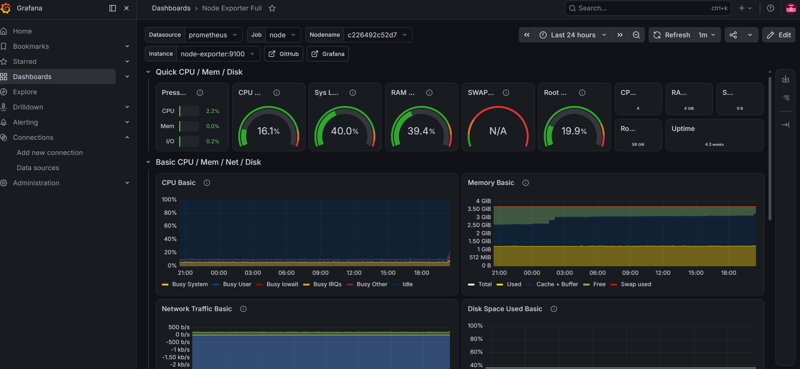
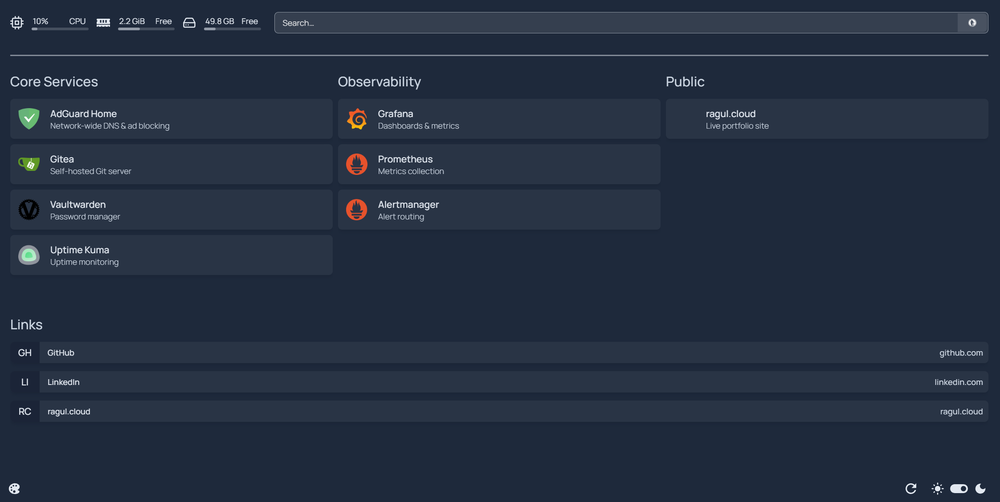
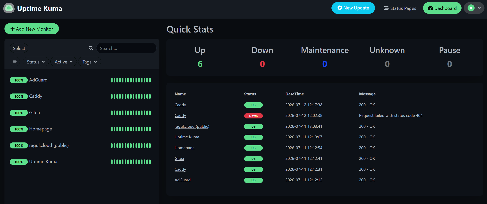

# Self-Hosted Infrastructure

A small, monitored, self-hosted server running on a Raspberry Pi 4 (4GB, Ubuntu 22.04) — networking, security, observability, automation, and backups, built and operated end to end.

**Live:** [ragul.cloud](https://ragul.cloud) — served from this exact setup.

---

## What this is

Not a tutorial I followed once — a system I run day to day, break on purpose sometimes, and fix. Everything here is version-controlled from the first commit, deployed with one Ansible command, monitored with real alerting, and backed up with a tested restore.

## Architecture

```
                         Internet
                            │
                  Cloudflare edge  (TLS / HTTPS)
                            │   ← outbound tunnel, zero open ports
                     cloudflared
                            │
                          Caddy  ───────────►  ragul.cloud   [PUBLIC]
                            │
   ┌────────────────────────┼─────────────────────────┐   [PRIVATE — Tailscale only]
 AdGuard Home            Gitea                    Vaultwarden
 Homepage                Prometheus / Grafana      Loki / Promtail
 Uptime Kuma             node-exporter / cAdvisor  Alertmanager
```

**Only one thing is public** — this website, reached through a Cloudflare Tunnel that makes an outbound-only connection from the Pi. No ports are forwarded on the router, and the home IP is never exposed. This also means it works behind CGNAT, which most Indian ISPs use and which makes traditional port forwarding impossible.

**Everything else is private**, reachable only over a WireGuard mesh VPN (Tailscale) — Gitea, the password manager, every dashboard.

## Screenshots

**Grafana — live host metrics**


**Homepage — service dashboard**


**Uptime Kuma — uptime monitoring**


## Design decisions

**One service public, everything else private.** A Cloudflare Tunnel exposes exactly one hostname; a catch-all rule refuses anything else. Internal services are reachable only over Tailscale.

**Monitored, not just running.** Prometheus scrapes the host and every container every 30 seconds. Loki collects logs so metrics and logs are searchable together in Grafana. Alert rules are written as code — service down, low disk, memory pressure, high CPU temperature — and Alertmanager routes them to Telegram. Stopping a service sends an alert within two minutes, and a recovery notice when it comes back.

**Reproducible from a bare OS.** An Ansible playbook takes a fresh Ubuntu install to the full running stack in one command. It's been tested for real — the Pi has actually been wiped and rebuilt this way. A GitHub Actions pipeline validates every Compose file and lints YAML on every push.

**Backups that have actually been restored.** Nightly encrypted backups with `restic` on a systemd timer, covering everything that can't be recovered from Git — Git data itself, the password vault, dashboards, tunnel credentials. The restore has been tested into a scratch directory and confirmed readable, not just assumed to work.

## What I'd change if I rebuilt it

It runs on a single node, so the Pi is a single point of failure — backups are tested, but there's no live redundancy. I evaluated running a workload on Kubernetes (K3s), measured the real cost (the control plane alone used over a gigabyte of RAM on a 4GB board), and decided against keeping it, since nothing here currently needs orchestration. Next steps would be a second node for redundancy and fully off-site backups.

## Stack

Linux · Docker · Docker Compose · Caddy · Tailscale (WireGuard) · Cloudflare Tunnel · Prometheus · Grafana · Loki · Alertmanager · Ansible · GitHub Actions · restic · Gitea · systemd · UFW

## Deploying from scratch

```bash
# Flash Ubuntu Server 22.04, enable SSH, then:
sudo apt install git ansible -y
git clone https://github.com/ragull-11/homelab.git ~/homelab
cd ~/homelab
ansible-galaxy collection install community.docker
ansible-playbook ansible/site.yml -i ansible/inventory.ini
```

One command rebuilds hardening, Docker, Tailscale, all services, the tunnel, and the observability stack. Secrets (Telegram token, tunnel credentials) are kept out of Git in gitignored `.env` files and restored separately — see [`docs/runbook.md`](docs/runbook.md) for the full recovery procedure.

## Repo structure

```
homelab/
├── ansible/          # playbook + roles that build the whole stack
├── compose/           # one folder per service, each with its own compose.yaml
├── monitoring/         # Prometheus, Grafana, Loki, Alertmanager configs
├── site/                # this website
├── docs/
│   ├── runbook.md      # disaster recovery procedure
│   └── screenshots/
├── learning-log/       # notes written while building each phase
└── .github/workflows/   # CI pipeline
```

---

[ragul.cloud](https://ragul.cloud) · [LinkedIn](https://linkedin.com/in/ragul11)
